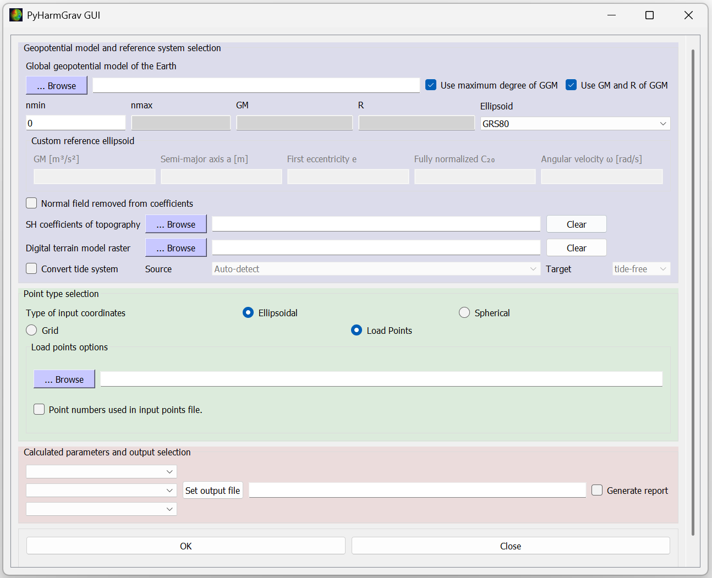

Graphical user interface
========================

Start the graphical interface after installing PyHarmGrav with::

   pyharmgrav_gui

The interface exposes the point and grid synthesis options through four main
parts:

1. **Model and reference system** -- Select the geopotential model, spherical
   harmonic degree range, model constants, and a GRS80, WGS84, or custom
   reference ellipsoid. Optional controls provide topographic coefficients, a
   digital terrain model raster, tide-system conversion, and models from which
   the normal field has already been removed.
2. **Coordinates** -- Choose ellipsoidal or spherical coordinates, then either
   load scattered points from a text file or define a regular grid. Grid inputs
   include latitude and longitude limits, separate grid steps, the resolution
   unit, reference-surface type, and height above the surface.
3. **Quantities and output** -- Select as many as three quantities for scattered
   points or one quantity for a grid, then choose the output file. The
   three-component ``g`` vector is restricted to scattered points. Grid results
   support NetCDF, GeoTIFF, and text output; point results are written as a text
   table.
4. **Run and report** -- Select **Generate report** to save the inputs, output
   column description, point or grid size, and computation time alongside the
   result. Select **OK** to run the calculation; completion and validation
   messages appear at the bottom of the window.

For the meaning and units of individual quantities, see
:doc:`api/gshs`.
